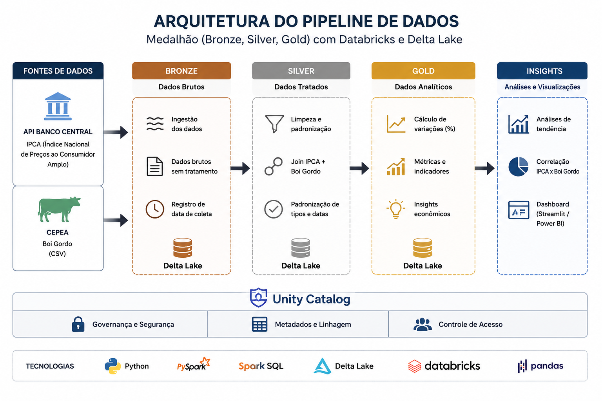

# Pipeline Econômico com Databricks, Spark e Delta Lake

Projeto de Engenharia de Dados utilizando arquitetura medalhão (Bronze, Silver e Gold) no Databricks para ingestão, tratamento e análise de dados econômicos.

O pipeline consome:

* Dados de IPCA via API do Banco Central
* Dados históricos de Boi Gordo via CSV (CEPEA)

Os dados são processados utilizando PySpark, armazenados em tabelas Delta Lake e organizados através do Unity Catalog.

\---

# Arquitetura do Pipeline



\---

# Objetivo do Projeto

O objetivo deste projeto é construir um pipeline de dados analítico capaz de:

* consumir dados de múltiplas fontes
* processar dados com Spark
* aplicar arquitetura medalhão
* gerar insights econômicos
* analisar variações entre inflação e preço do boi gordo

\---

# Tecnologias Utilizadas

* Python
* PySpark
* Spark SQL
* Delta Lake
* Databricks
* Unity Catalog
* Pandas
* API REST

\---

# Estrutura do Projeto

```bash
pipeline-economia-databricks/
│
├── notebooks/
│   ├── 00\_config.py
│   ├── 01\_bronze\_ipca.py
│   ├── 02\_bronze\_boi\_gordo.py
│   ├── 03\_silver\_economia.py
│   ├── 04\_gold\_insights.py
│
├── images/
│   ├── arquitetura.png
│   ├── catalog.png
│ 
│ 
├── README.md
├── requirements.txt
└── .gitignore
```

\---

# Arquitetura Medalhão

## Bronze Layer

Camada responsável pela ingestão bruta dos dados.

### Fontes:

* API do Banco Central (IPCA)
* CSV do CEPEA (Boi Gordo)

### Processos:

* ingestão de dados
* armazenamento bruto
* registro de data de coleta

\---

## Silver Layer

Camada responsável pelo tratamento e padronização dos dados.

### Transformações:

* tratamento de datas
* padronização de tipos
* joins entre IPCA e Boi Gordo
* limpeza de dados

### Tecnologias:

* PySpark
* Spark SQL

\---

## Gold Layer

Camada analítica contendo métricas e indicadores econômicos.

### Insights gerados:

* variação percentual do IPCA
* variação percentual do Boi Gordo
* análises históricas
* indicadores analíticos

\---

# Unity Catalog

O projeto utiliza Unity Catalog para organização e governança das tabelas Delta.

## Estrutura:

* bronze\_economia
* silver\_economia
* gold\_economia

\---

# Exemplos do Projeto

## Unity Catalog

!\[Catalog](images/catalog.png)

\---


# Fluxo do Pipeline

```text
API Banco Central ─┐
                   ├── Bronze ── Silver ── Gold ── Insights
CSV CEPEA ─────────┘
```

\---

# Principais Conceitos Aplicados

* Engenharia de Dados
* Arquitetura Medalhão
* Data Lakehouse
* Processamento Distribuído
* ETL/ELT
* Governança de Dados
* Delta Lake
* Analytics Engineering

\---

# Fontes dos Dados

## Banco Central (IPCA)

https://api.bcb.gov.br/dados/serie/bcdata.sgs.433/dados

## CEPEA (Boi Gordo)

https://cepea.org.br/br/consultas-ao-banco-de-dados-do-site.aspx

\---

# Como Executar

## 1\. Configurar ambiente Databricks

Criar schemas:

* bronze\_economia
* silver\_economia
* gold\_economia

\---

## 2\. Executar notebooks na ordem

```text
00\_config
↓
01\_bronze\_ipca
↓
02\_bronze\_boi\_gordo
↓
03\_silver\_economia
↓
04\_gold\_insights
```

\---

# Instalação

```bash
pip install -r requirements.txt
```

\---

# Requirements

```text
pyspark
pandas
requests
delta-spark
```

\---

# Próximos Passos

Melhorias futuras possiveis:

* Dashboard com Streamlit
* Orquestração com Airflow
* Pipeline incremental
* Monitoramento e logging
* Data Quality
* Deploy automatizado

\---

# Autor

Joel de Jesus da Cruz

Estudante e desenvolvedor focado em:

* Engenharia de Dados
* Ciência de Dados
* Finanças Quantitativas
* Analytics Engineering


Contexto Acadêmico


Este projeto foi desenvolvido no contexto da pós-graduação:


Pós-graduação Lato Sensu - Especialização em Engenharia de Dados \& Inteligência Artificial


com foco em:


arquitetura de pipelines de dados

processamento distribuído

engenharia analítica

Delta Lake

Spark e Databricks

modelagem de dados analíticos

